# Instalasi Git

## Instalasi Git untuk Windows

- Download Git Installer untuk Windows menggunakan [link](https://git-scm.com/download/win) berikut. Pilih link paling atas untuk mengunduh versi Git rekomendasi
- Jalankan installer (.exe) Git yang baru saja kalian unduh

  - Klik Next pada halaman pertama
    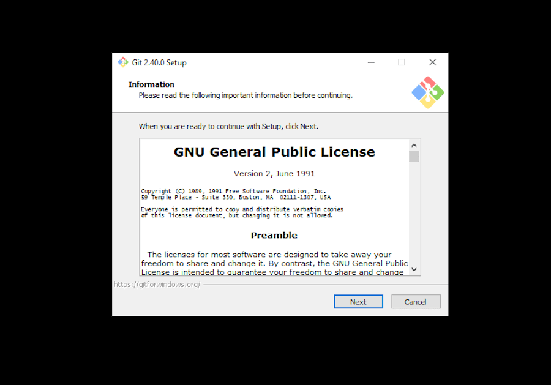
  - Kemudian tentukan folder instalasi, bisa kalian ubah atau biarkan default
    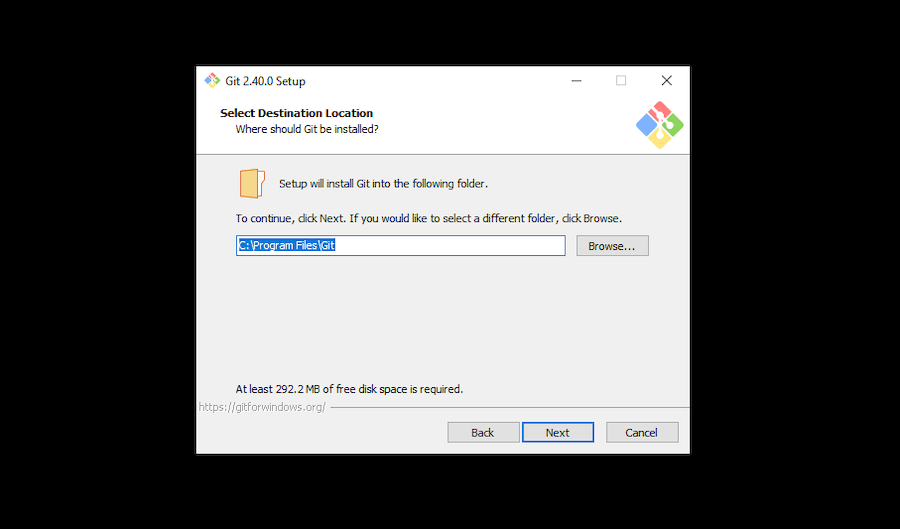
  - Pilihan komponen Git yang akan diinstall akan muncul, kecuali kalian tahu komponen yang ingin ditambahkan, biarkan default. **Pastikan Git Bash tercentang**
    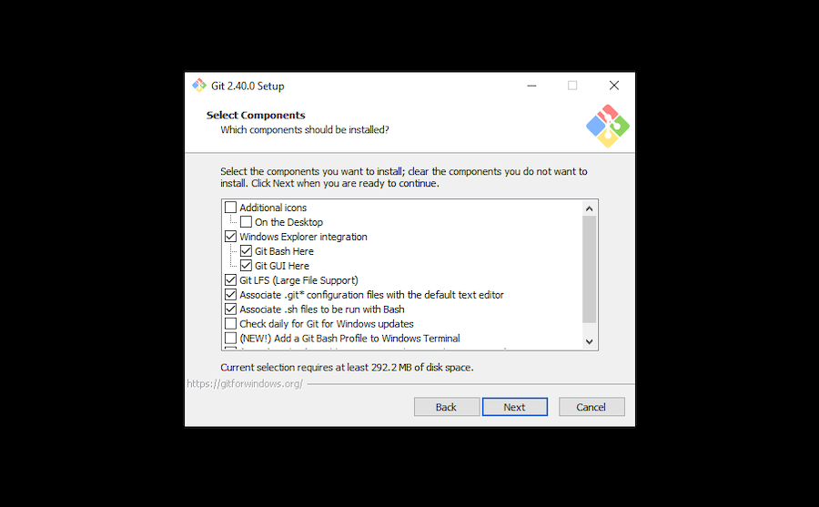
  - Kemudian kalian diminta memilih folder shortcut untuk Git, biarkan default
    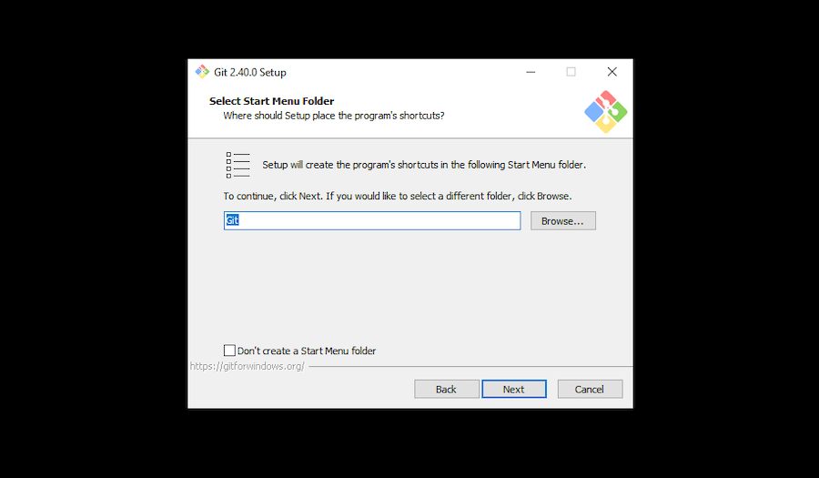
  - Selanjutnya kalian diminta memilih text editor yang akan dipakai oleh Git, biarkan default menggunakan Vim
    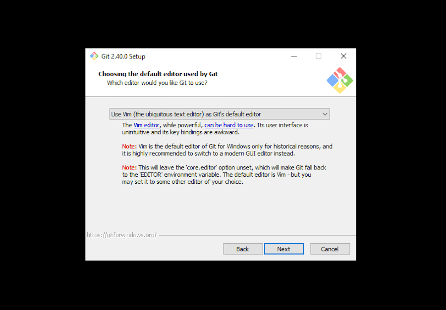
  - Kemudian kalian diminta memasukkan nama branch awal (konsep branch akan kita bahas pada materi) , untuk kemudahan integrasi dengan GitHub nantinya pilih **Override** lalu isikan `main` sebagai nama branch awal
    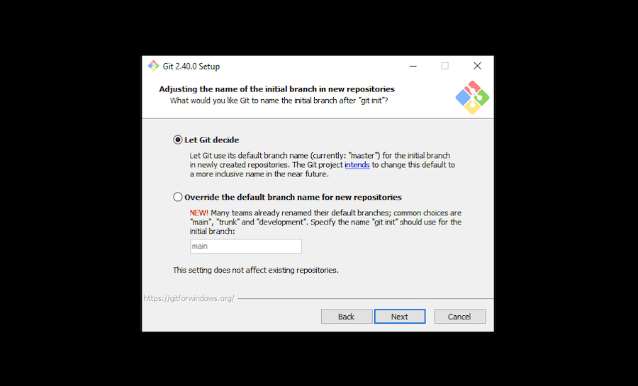
  - Kemudian kalian diminta menyesuaikan PATH pada Windows, pilih opsi kedua **Git from the command line and also from 3rd party software** agar Git bisa digunakan dari dalam VSCode
    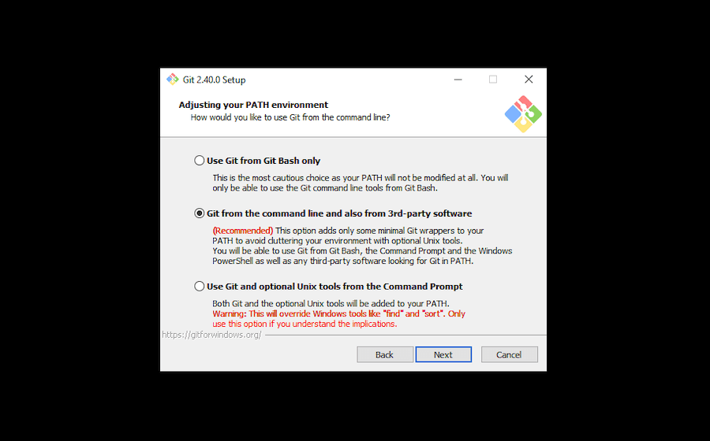
  - Selanjutnya kalian diminta memilih SSH Client, pilih saja SSH Client bawaan git yaitu OpenSSH dengan memilih opsi 1
    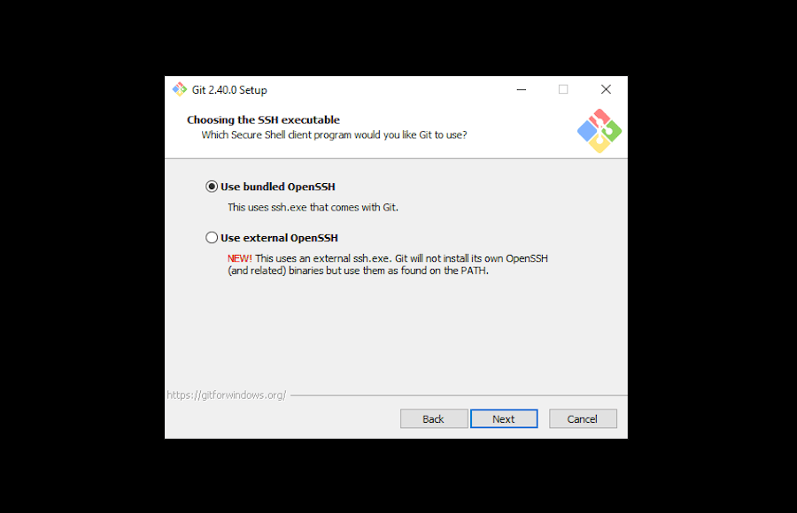
  - Kemudian kalian diminta memilih sertifikat SSL untuk kebutuhan HTTPS, biarkan default menggunakan OpenSSL
    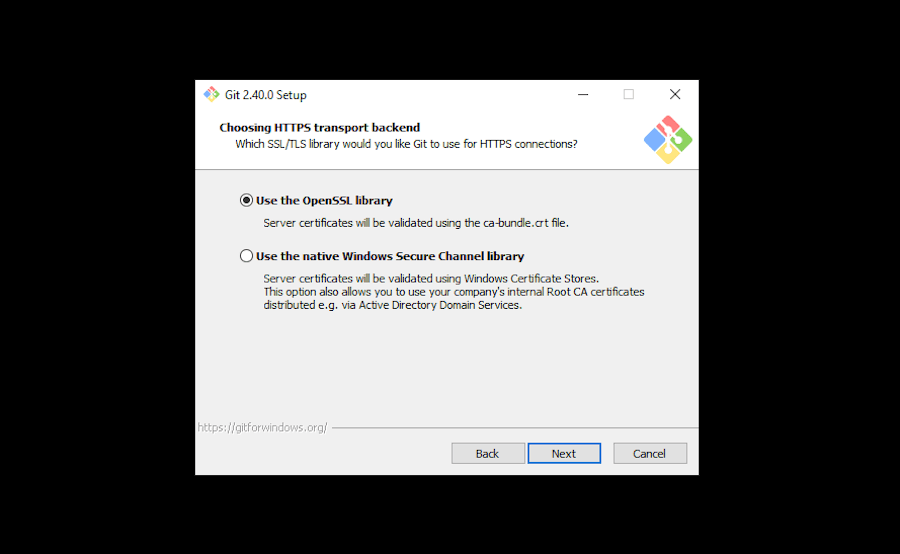
  - Selanjutnya untuk style line-ending, biarkan default pada opsi 1
    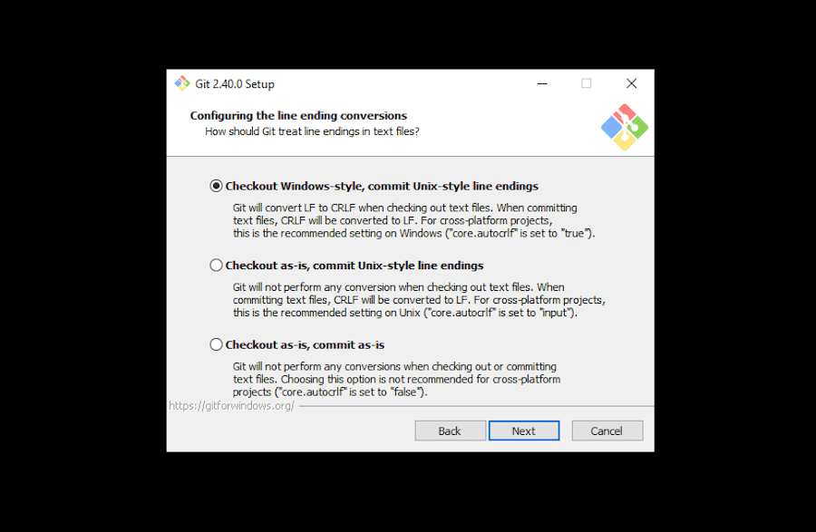
  - Kemudian kalian diminta memilih terminal emulator, pilih default menggunakan MinTTY
    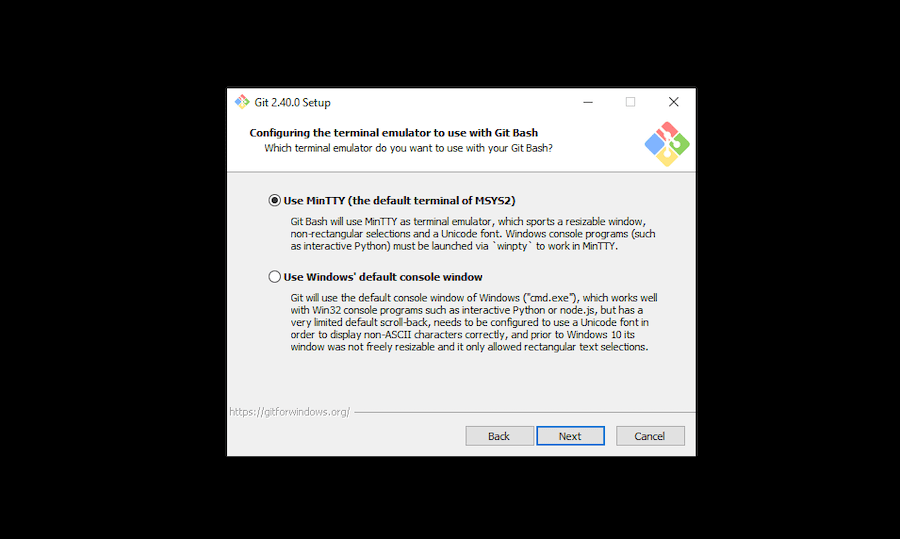
  - Selanjutnya untuk menentukan behaviour saat melakukan **git pull** (konsep git pull akan kita bahas pada materi), biarkan default yaitu `fast-forward and merge`
    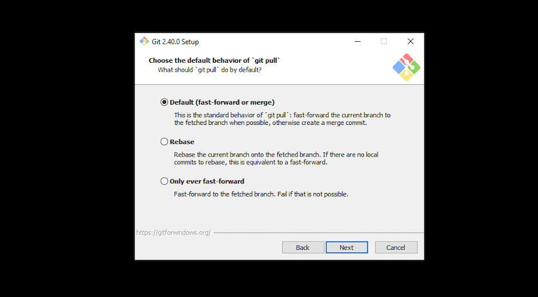
  - Kemudian untuk credential helper biarkan default
    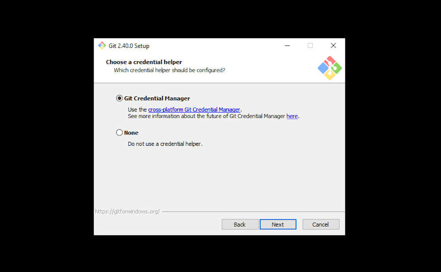
  - Kemudian untuk extra options, biarkan default
    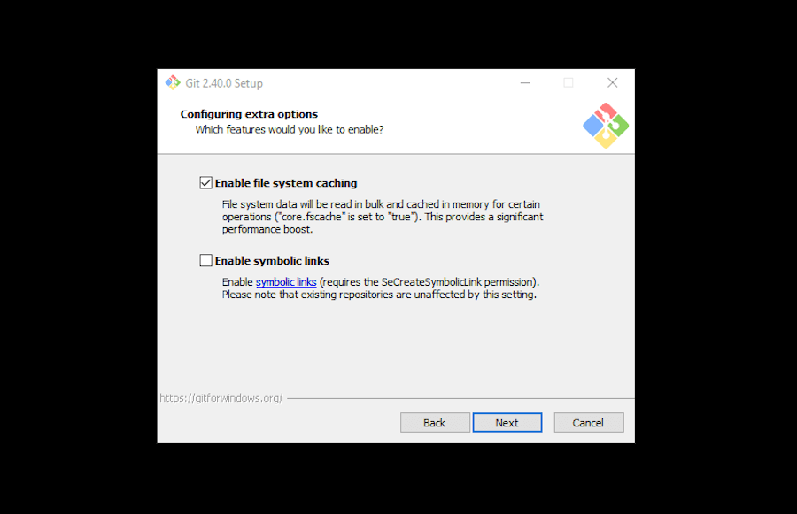
  - Selanjutnya untuk fitur experimental, biarkan kosong, lalu klik **Install**
    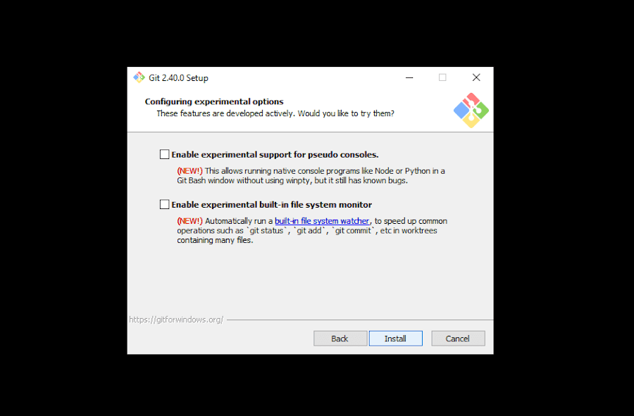

- Setelah langkah - langkah diatas sudah kalian lakukan semua, buka program **Git Bash** dari menu pencarian Windows, kemudian ketikkan `git --version` lalu tekan Enter. Jika instalasi berhasil maka akan muncul nomor versi Git yang baru saja kalian install. Selamat!

## Instalasi Git untuk MacOS dan Linux

### MacOS

Untuk Operating System berbasis Unix seperti MacOS dan Linux, instalasi Git relatif lebih mudah dibanding Windows.

Untuk MacOS pastikan kalian sudah menginstall [Homebrew](https://brew.sh/) dengan mengetikkan

```
$ /bin/bash -c "$(curl -fsSL https://raw.githubusercontent.com/Homebrew/install/HEAD/install.sh)"
$ brew --version
```

dan melakukan instalasi XCode CLI Tools dengan mengetikkan

```
$ xcode-select --install
```

kemudian lakukan instalasi Git dengan command berikut

```
$ brew install git
$ git --version
```

Jika instalasi berhasil maka akan muncul nomor versi Git yang baru saja kalian install. Selamat!

### Linux

Linux terdiri dari berbagai macam distro, untuk modul ini hanya dikhususkan distro linux turunan debian seperti Ubuntu dengan package manager bawaan yaitu `apt`. Kalian dapat menginstall Git dengan command berikut

```
$ sudo apt-get install git
$ git --version
```

Jika instalasi berhasil maka akan muncul nomor versi Git yang baru saja kalian install. Selamat!

## Setup Git

Setelah kalian berhasil melakukan instalasi Git pada OS masing-masing, selanjutnya adalah melakukan setup Git untuk memberi tahu nama dan email kita kepada git. Caranya buka **Git Bash** untuk pengguna Windows dan buka terminal untuk pengguna MacOS atau Linux lalu ketikkan command berikut

```
$ git config --global user.name "Your Name"
$ git config --global user.email "youremail@example.com"
```

ubah "Your Name" dan "youremail@example.com" dengan Nama dan Email kalian masing-masing. Penting untuk diingat, pastikan email yang kalian tulis adalah email aktif yang nantinya akan digunakan untuk pendaftaran GitHub.

> Disarankan **tidak menggunakan email kampus** karena akun GitHub akan kalian pakai seterusnya, jika akses email kampus dinonaktifkan setelah kalian lulus maka cukup menjadi masalah

# Mendaftar Github

Setelah instalasi Git selesai kalian lakukan. Langkah selanjutnya adalah mendaftar GitHub menggunakan [link ini](https://github.com/signup), Ikuti langkah - langkahnya sampai selesai. Pastikan mendaftar akun dengan email yang sama saat kalian melakukan setup Git pada langkah sebelumnya

## Integrasi Git dengan GitHub

Setelah kalian memiliki akun github, untuk memudahkan integrasu Git dan GitHub kedepannya kita akan melakukan setup SSH Key. Untuk tutorial lengkapnya kalian bisa akses [disini](https://docs.github.com/en/authentication/connecting-to-github-with-ssh/adding-a-new-ssh-key-to-your-github-account)

Untuk keperluan kita saat ini, akan saya simplifikasi dengan langkah-langkah berikut:

- Buka Git Bash untuk pengguna Windows dan terminal untuk pengguna MacOS dan Linux
- Ketikkan command berikut untuk membuat SSH Key

  ```
  $ ssh-keygen -t ed25519 -C "your_email@example.com"
  ```

  Gunakan email yang sama dengan langkah sebelumnya. Kemudian akan muncul beberapa prompt seperti

  ```
  > Enter a file in which to save the key (/Users/YOU/.ssh/id_ALGORITHM): [Press enter]
  > Enter passphrase (empty for no passphrase): [Type a passphrase]
  >  Enter same passphrase again: [Type passphrase again]
  ```

  Cukup tekan **Enter** sampai seluruh prompt selesai.

- Kemudian untuk mendaftarkan SSH Key kepada SSH Agent pada komputer kalian masing-masing dengan mengetikkan command

  - **Windows** <br>
    Buka Windows Powershell sebagai admin, kemudian ketikkan command berikut

    ```
    > Get-Service -Name ssh-agent | Set-Service -StartupType Manual
    > Start-Service ssh-agent
    ```

    Kembali ke Git Bash, ketikkan command berikut

    ```
    $ ssh-add /c/Users/YOU/.ssh/id_ed25519
    ```

    **sesuaikan YOU dengan username Windows kalian**

  - **MacOS dan Linux**

    ```
    $ eval "$(ssh-agent -s)"
    $ ssh-add ~/.ssh/id_ed25519
    ```

- Selanjutnya kalian copy isi dari SSH Key yang baru saja kalian buat, Untuk pengguna Windows file berada pada folder `C:` dengan path `/c/Users/YOU/.ssh/id_ed25519.pub`, YOU merupakan username Windows kalian. Untuk pengguna MacOS dan Linux berapa pada Home dir, dengan path `~/.ssh/id_ed25519.pub`

  > **Perhatikan!** Yang kalian copy adalah file dengan nama yang sama dengan yang kalian daftarkan kepada SSH Agent pada langkah sebelumnya yaitu `id_ed25519`, perbedaannya saat ini yang harus kalian copy isi filenya adalah dengan extensi `.pub`

- Setelah selesai kalian copy, kembali ke Browser masing - masing kemudian buka GitHub kalian, di pojok kanan atas akan ada foto profil GitHub kalian, klik, kemudian pilih Settings
  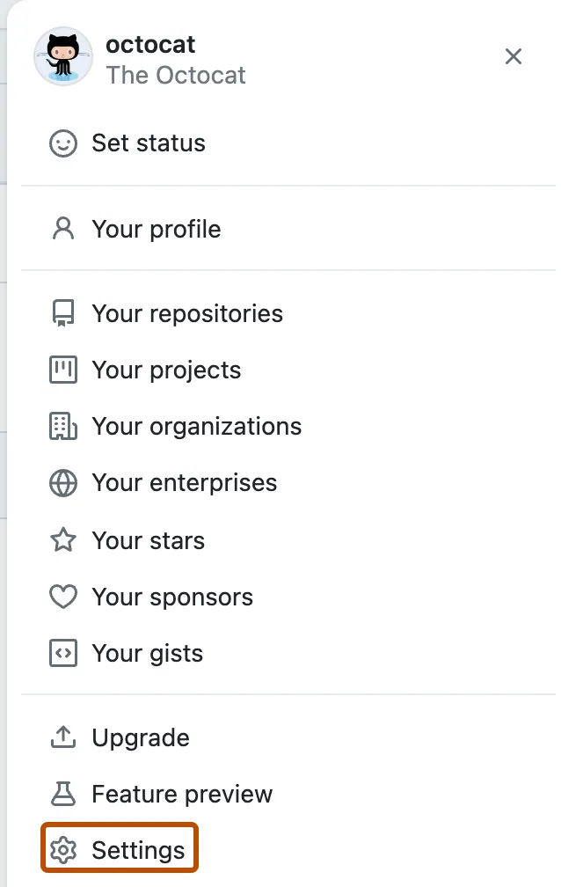

- Kemudian pada tab Access, pilih `SSH and GPG keys`
  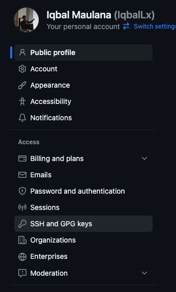

- Kemudian klik `New SSH key`
- Isikan Title dengan Nama Komputer kalian untuk memudahkan klasifikasi, misalkan `Laptop Linux Iqbal`
- Kemudian pastekan isi SSH Key tadi kedalam field Key, lalu klik `Add SSH Key`

Selamat kalian sudah siap untuk mengikuti sesi Git dan GitHub nanti. See you!
