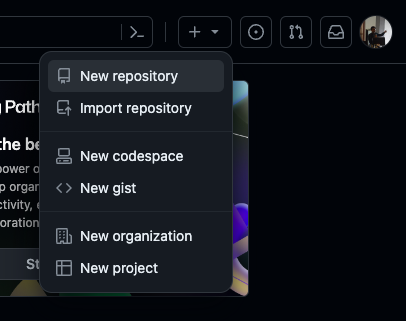
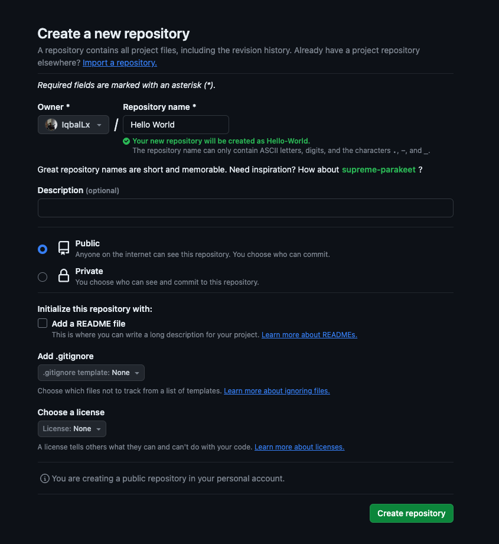

# Membuat Repository

Ketika memulai proyek aplikasi yang nantinya akan menggunakan Git, kita perlu membuat Git Repository atau Git Repo singkatnya. Untuk mulai membuat Git Repository baru kita perlu membuatnya pada komputer kita dan pada GitHub.

## Membuat Repository pada Lokal Komputer

Untuk membuat git repository baru didalam komputer kita masing-masing, langkah-langkahnya adalah sebagai berikut:

1. Buat folder baru yang akan digunakan sebagai tempat proyek
2. Untuk pengguna Windows, buka folder tadi menggunakan File Explorer, kemudian klik kanan, pilih `Open Git Bash Here`. Untuk pengguna MacOS dan Linux cukup pindah ke lokasi folder tersebut menggunakan `cd`
3. Untuk membuat git repository baru, ketikkan command
   ```
   $ git init
   ```

Selamat! Kalian telah selesai membuat git repository baru pada lokal komputer kalian.

## Membuat Repository pada GitHub

Sebagai pelengkap repository lokal, kita juga akan membuat repository baru di GitHub. Repository pada GitHub nantinya akan menjadi sumber referensi perubahan utama ketika kita melakukan kolaborasi dalam koding.

Untuk membuat repository baru pada GitHub, langkah yang harus dilakukan:

1. Buka GitHub pada browser masing-masing, kemudian login dengan akun yang telah dibuat sebelumnya
2. Di halaman Home GitHub, pada pojok kanan atas, terdapat logo "+", klik, lalu pilin `New repository`  
   
3. Selanjutnya kalian akan dibawa pada halaman untuk melengkapi informasi pada repository yang akan kalian buat  
   
   Pada bagian `Repository Name` isikan nama yang sama seperti nama folder kalian tadi. Kemudian untuk kolom `Description` dapat diisi dengan deskripsi proyek didalam repository ini.

   > Sebagai referensi kalian bisa isi nama aplikasi dan kegunaan nya pada kolom deskripsi ini

   Selanjutnya biarkan default pada opsi `Public`, tidak perlu centang dan ubah apapun pada opsi dibawahnya.

   Lalu klik `Create repository`

Selamat! Kalian telah selesai membuat git repository baru pada akun GitHub kalian. Kita akan belajar bagaimana cara sinkronisasi repository lokal kita dengan repository pada GitHub pada materi mendatang.
