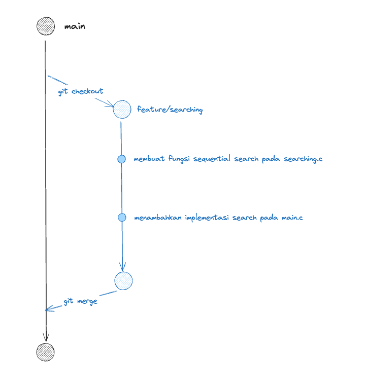

# Membuat Perubahan Berkelompok

Pada umumnya perubahan pada kode dilakukan secara berkelompok yang dapat terdiri dari lebih dari satu commit. Sebagai contoh fitur searching arrray dapat terdiri dari:

- `commit 1`: membuat fungsi sequential search pada searching.c
- `commit 2`: menambahkan implementasi search pada main.c

Keuntungan menggunakan Git kita dapat mengelompokkan semua perubahan tersebut menjadi satu terlebih dahulu dengan konsep `Git Branch`

## Gambaran Besar Branch pada Git



Diagram diatas adalah bagaimana gambaran umum sebuah branch pada Git. Jika dilihat striktur yang terlihat adalah seperti pohon dengan `main` sebagai batang pohon dan `feature/searching` sebagai cabang dari pohon.

## Membuat Cabang Baru

Untuk membuat branch baru kalian dapat menggunakan command berikut

```
$ git branch <nama cabang>
```

Secara umum `nama cabang` terdiri dari 1 sampai 2 kata yang mewakili perubahan yang akan kalian lakukan pada cabang tersebut. Sebagai contoh pada diagram diatas nama cabang yang digunakan adalah `feature/searching` yang mengindikasikan bahwa pada cabang tersebut akan dilakukan penambahan fitur search

## Berpindah Antar Cabang

Setelah kalian sukses menambahkan cabang baru, kalian dapat melihat daftar cabang yang tersedia didalam repository kalian menggunakan command

```
$ git branch
```

Kalian akan melihat nama cabang yang baru saja kalian buat. Untuk berpindah dari cabang saat ini ke cabang baru tersebut, kita dapat menggunakan

```
$ git checkout <nama cabang tujuan>
```

Secara default ketika kita menambahkan cabang baru, git tidak akan langsung memindahkan posisi kita ke cabang baru tersebut, untuk mempermudah langkah membuat cabang baru sekaligus berpindah pada cabang tersebut dapat menggunakan command

```
$ git checkout -b <nama cabang>
```

**Perhatikan!** penambahan `-b` diatas mengindikasikan untuk membuat cabang baru, sementara tanpa `-b` berarti kita berpindah ke cabang yang telah ada sebelumnya

## Menambahkan Perubahan pada Cabang ke Cabang lainnya

Setelah kalian selesai melakukan perubahan yang diinginkan pada cabang lain, waktunya kalian menambahkan kembali seluruh perubahan tersebut ke `main` yang merupakan cabang utama repository kita.

Caranya adalah dengan menggunakan command

```
$ git merge <nama cabang>
```

> Secara umum proses `merge` ini tidak dilakukan di lokal komputer, tetapi menggunakan GitHub melalu proses `Merge Request` atau biasa disingkat MR. Materi ini akan kita bahas pada modul selanjutnya
