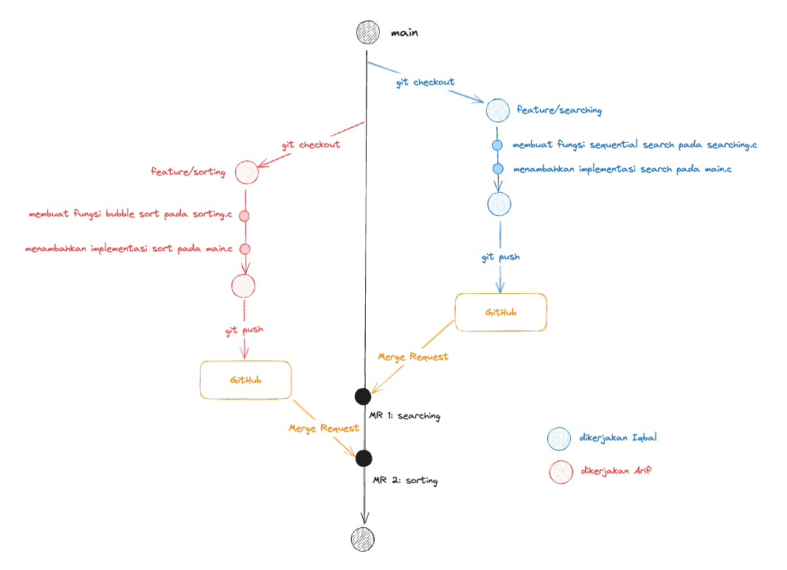

# Sinkronisasi Perubahan

## Gambaran Besar Proses Sinkronisasi Perubahan



Diagram diatas adalah versi update dari diagram pada modul sebelumnya, dimana sekarang GitHub muncul untuk pertama kalinya.

## Menambahkan Perubahan pada Branch ke GitHub

Setelah kalian selesai menambahkan perubahan pada branch kalian. Kalian dapat melakukan sinkronisasi perubahan tersebut ke GitHub dengan menggunakan command

```
$ git push
```

Command diatas akan menambahkan branch beserta seluruh perubahan yang kalian lakukan ke GitHub. Prosesnya mirip seperti kalian mengupload file kalian ke E-Learning atau Google Drive

## Melakukan Merge Request

Setelah kalian mengupload seluruh perubahan kalian menggunakan `git push` pada langkah sebelumnya. Langkah selanjutnya adalah mengembalikan seluruh perubahan tersebut kepada cabang utama kita, yaitu `main`.

Proses ini disebut `Merge` sama seperti sebelumnya, tetapi saat ini kita melakukannya melalui GitHub dengan nama `Merge Request` atau disingkat MR.

Untuk melakukan MR, langkah-langkahnya adalah:

1.
