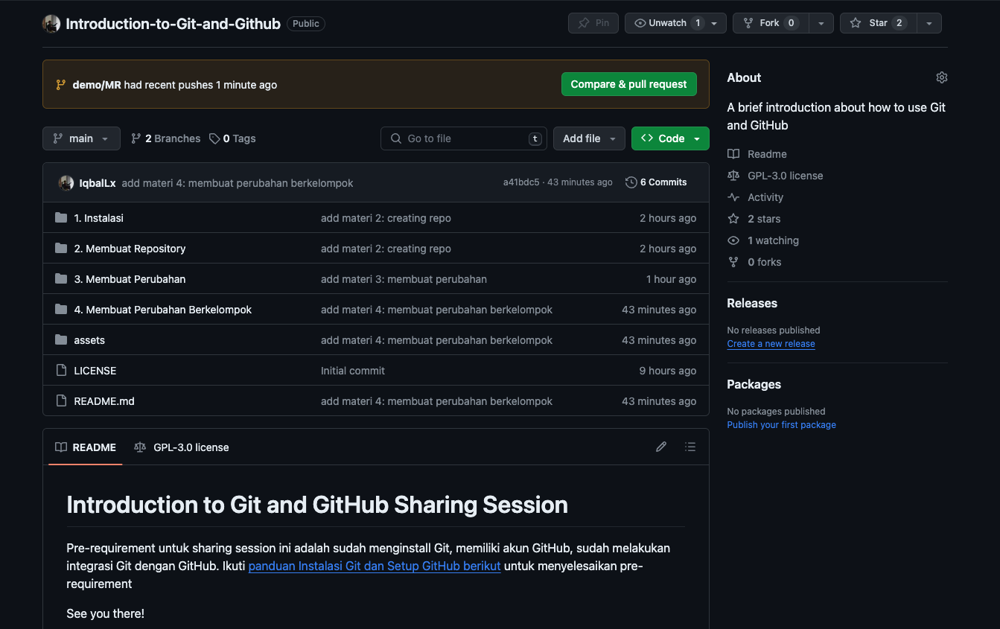
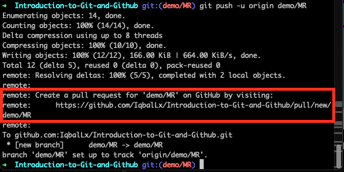
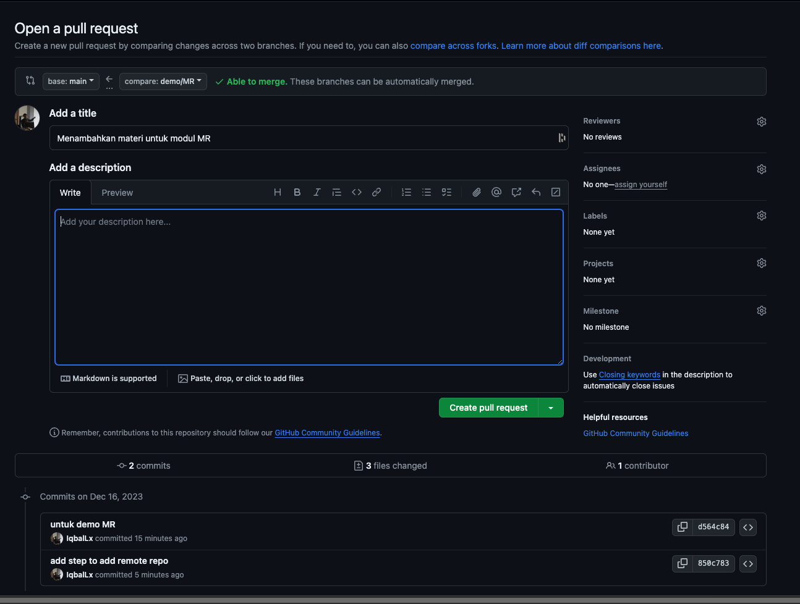
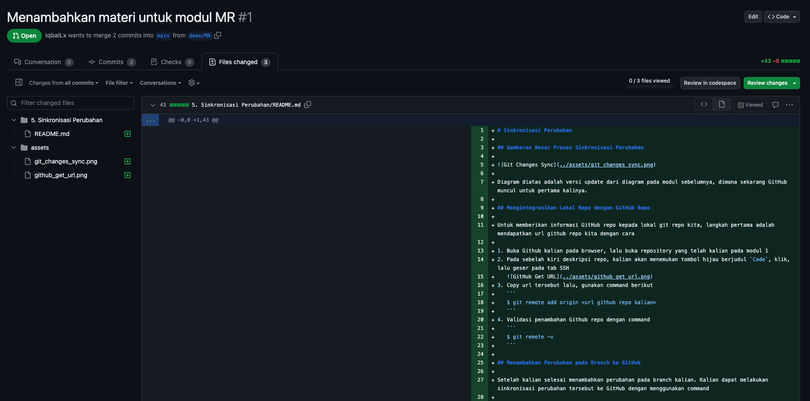
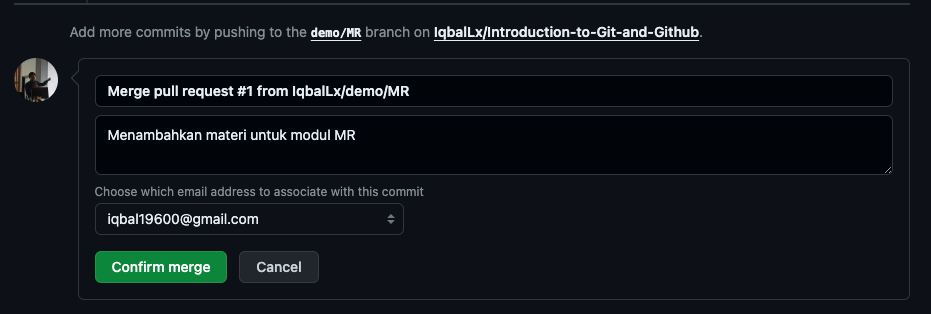
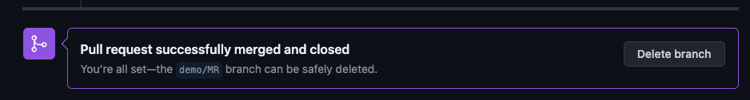
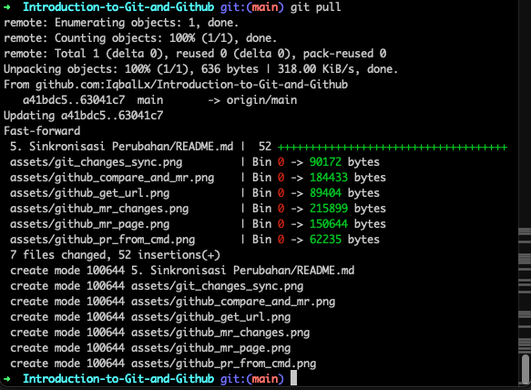

# Sinkronisasi Perubahan

## Gambaran Besar Proses Sinkronisasi Perubahan


Diagram diatas adalah versi update dari diagram pada modul sebelumnya, dimana sekarang GitHub muncul untuk pertama kalinya.

## Mengintegrasikan Lokal Repo dengan GitHub Repo

Untuk memberikan informasi GitHub repo kepada lokal git repo kita, langkah pertama adalah mendapatkan url github repo kita dengan cara

1. Buka Github kalian pada browser, lalu buka repository yang telah kalian pada modul 1
2. Pada sebelah kiri deskripsi repo, kalian akan menemukan tombol hijau berjudul `Code`, klik, lalu geser pada tab SSH
   
3. Copy url tersebut lalu, gunakan command berikut
   ```
   $ git remote add origin <url github repo kalian>
   ```
4. Validasi penambahan Github repo dengan command
   ```
   $ git remote -v
   ```

## Menambahkan Perubahan pada Branch ke GitHub

Setelah kalian selesai menambahkan perubahan pada branch kalian. Kalian dapat melakukan sinkronisasi perubahan tersebut ke GitHub dengan menggunakan command

```
$ git push -u origin <nama branch>
```

Command diatas akan menambahkan branch beserta seluruh perubahan yang kalian lakukan ke GitHub. Prosesnya mirip seperti kalian mengupload file kalian ke E-Learning atau Google Drive

## Melakukan Merge Request

Setelah kalian mengupload seluruh perubahan kalian menggunakan `git push` pada langkah sebelumnya. Langkah selanjutnya adalah mengembalikan seluruh perubahan tersebut kepada cabang utama kita, yaitu `main`.

Proses ini disebut `Merge` sama seperti sebelumnya, tetapi saat ini kita melakukannya melalui GitHub dengan nama `Merge Request` atau disingkat MR.

Untuk melakukan MR, langkah-langkahnya adalah:

1. Sesaat setelah kalian melakukan push, maka akan tampil tombol hijau diatas repo kalian dengan judul `Compare & pull request`, klik tombol tersebut  
    
   atau bisa juga dengan klik URL yang tampil pada terminal kalian seperti ini  
   
2. Kemudian kalian akan dibawa ke laman Merge Request, isikan judul MR dan deskripsi singkat sesuai perubahan yang kalian tambahkan. Setelah selesai klik `Create pull request`
   
3. Berikutnya teman kalian dapat melihat perubahan apa yang kalian coba buat dengan membuka tab `Changes`
   
4. Jika ada revisi yang diperlukan, teman kalian dapat menambahkan komen pada laman MR tersebut, kemudian kalian sebagai pemilik MR dapat menambahkan revisi yang diinginkan pada branch lokal kalian, kemudian mengulangi command `git push`
5. Setelah semua orang dalam proyek sepakat, kalian bisa menambahkan perubahan ini ke cabang utama dengan menekan tombol `Merge pull request`, kemudian pastikan pemilik MR sudah sesuai, lalu tekan `Confirm merge`
   

Setelah kalian sukses melakukan Merge, maka akan ada informasi sebagai berikut pada laman MR kalian tadi


Kalian akan diberikan opsi untuk menghapus cabang kalian tadi setelah Merge selesai, untuk saat ini biarkan saja cabang tersebut untuk keperluan riwayat cabang.

## Sinkronisasi Perubahan dari MR

Langkah selanjutnya setelah MR berhasil, kalian dan teman kalian dapat kembali ke cabang utama, yaitu `main` kemudian menarik semua perubahan dari MR tadi dengan menggunakan `git pull`

```
$ git checkout main
$ git pull
```



Maka kalian dan teman kalian akan mandapatkan perubahan terkini
