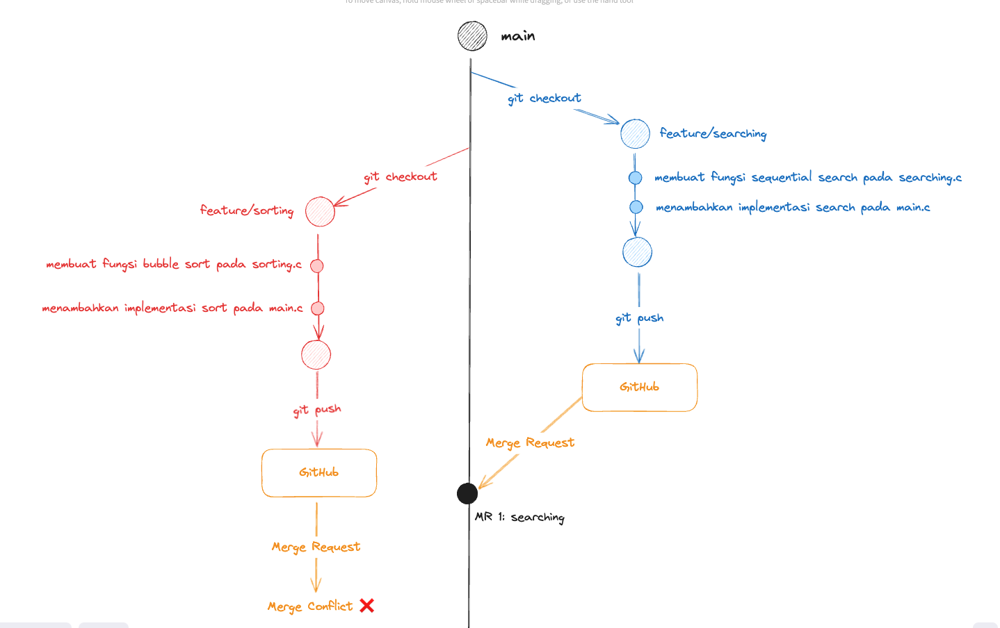
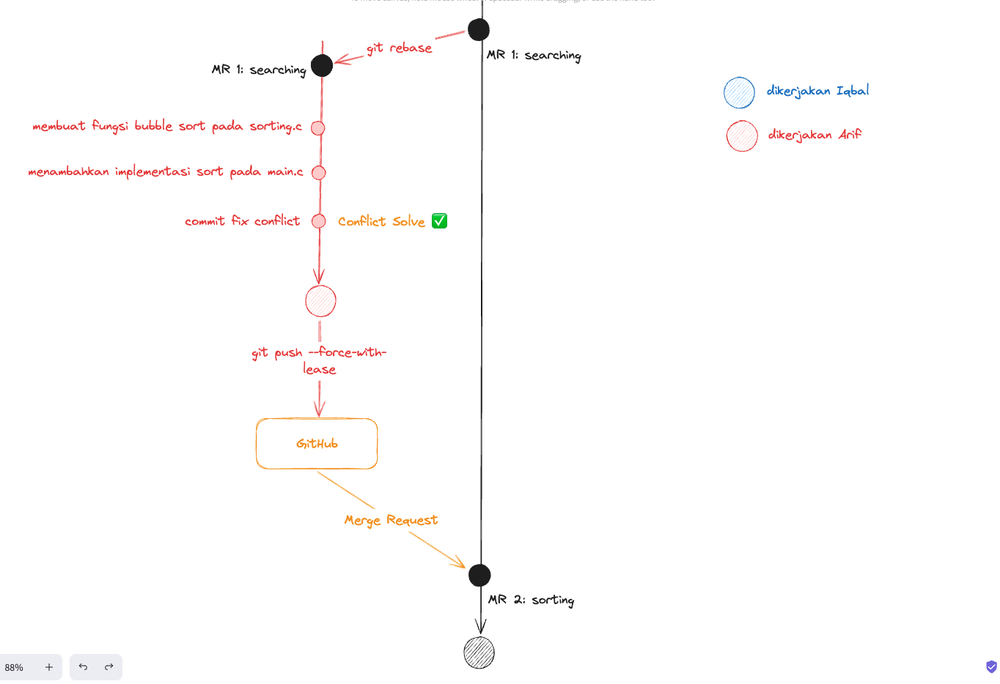
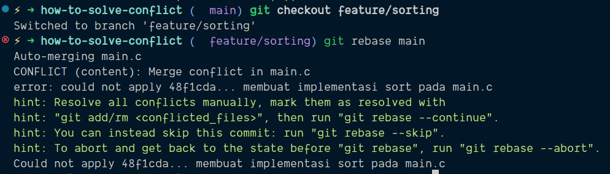
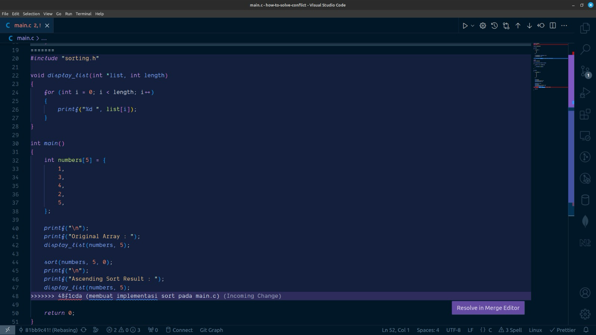
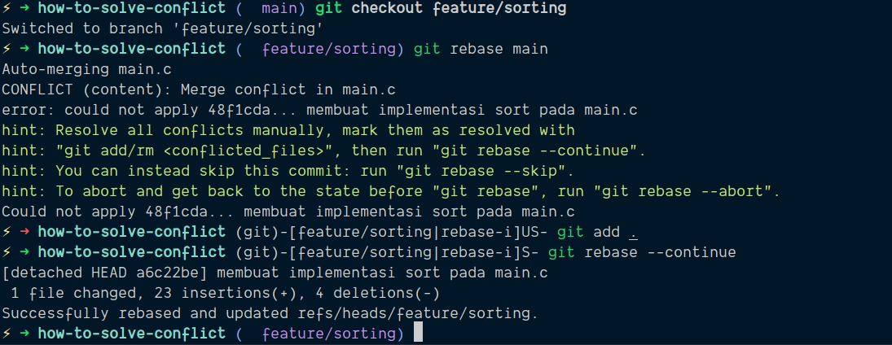
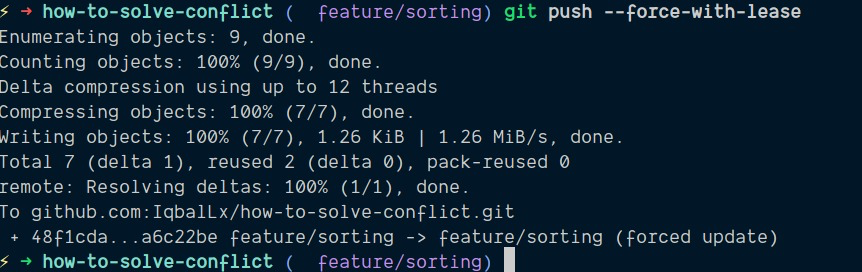
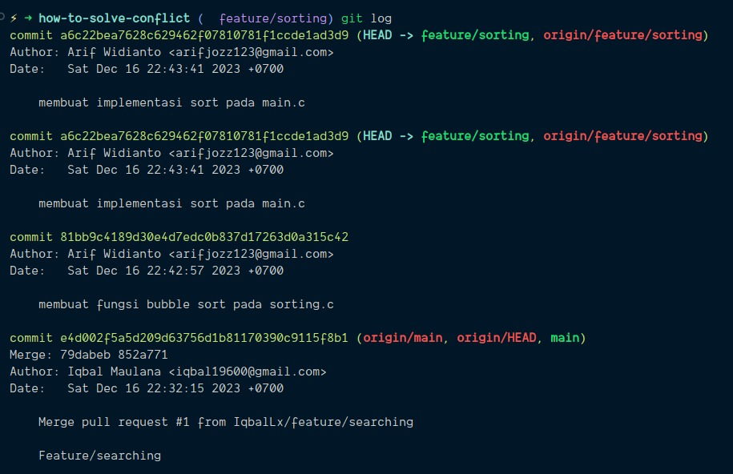

# Menangani Konflik Kode

Konflik pada kode umumnya terjadi ketika lebih dari 1 commit mengubah file dengan baris kode yang sama. Salah satu alasan terjadinya konflik adalah kalian dan teman kalian mengubah file yang sama, semisal `main.c` pada baris 1. MR teman kalian merge terlebih dahulu ke main, ketika kalian membuat MR maka akan ada penanda Merge Conflict disana


Sehingga kalian perlu melakukan step tambahan untuk melakukan penanganan terhadap konflik yang terjadi. Sebagai contoh pada [repo demo berikut](https://github.com/IqbalLx/how-to-solve-conflict) ketika [MR kedua](https://github.com/IqbalLx/how-to-solve-conflict/pull/2) akan di merge akan terjadi conflict pada file `main.c`

## Melakukan Git Rebase untuk Menyelesaikan Konflik di Lokal Komputer

Konsep rebase adalah kita menempatkan riwayat perubahan kode pada cabang utama yaitu `main` sebelum perubahan kode pada cabang fitur milik kita. Visualisasinya seperti berikut




Langkah - langkah untuk melakukan Git Rebase adalah sebagai berikut:

1. Pindah ke cabang utama dengan command, kemudian pull semua perubahan terbaru dari cabang utama tersebut
   ```
   $ git checkout main
   $ git pull
   ```
2. Pindah kembail ke cabang fitur kalian, kemudian ketikkan
   ```
   $ git rebase main
   ```
3. Maka di terminal kalian akan muncul file mana saja yang memiliki konflik
   
4. Untuk menyelesaikan konflik kalian bisa menggunakan fitur VSCode
   
5. Setelah kalian selesai memperbaiki konflik pada kode kalian, kalian bisa melanjutkan proses rebase dengan command berikut
   ```
   $ git add .
   $ git rebase --continue
   ```
   
6. Langkah terakhir adalah mengupdate kode pada branch GitHub kalian dengan command
   ```
   $ git push --force-with-lease
   ```
   

Setelah kalian melakukan langkah-langkah diatas maka kalian bisa kembali ke halaman MR kalian dan bisa melanjutkan review kemudian di merge seperti sebelumnya

> Ketika melakukan penanganan konflik pada kode, **Komunikasi adalah koentji**, komunikasikan perubahan kode kalian kepada teman kalian dan jika memungkinkan selesaikan konflik pada kode secara bersamaan

Kalian bisa amati bagaimana riwayat perubahan Git kalian setelah melakukan rebase dengan command `git log`. Seperti pada gambar berikut


Dapat kita ketahui bahwa riwayat perubahan kode untuk fitur sorting kini berada setelah riwayat MR fitur sebelumnya yaitu fitur searching.
