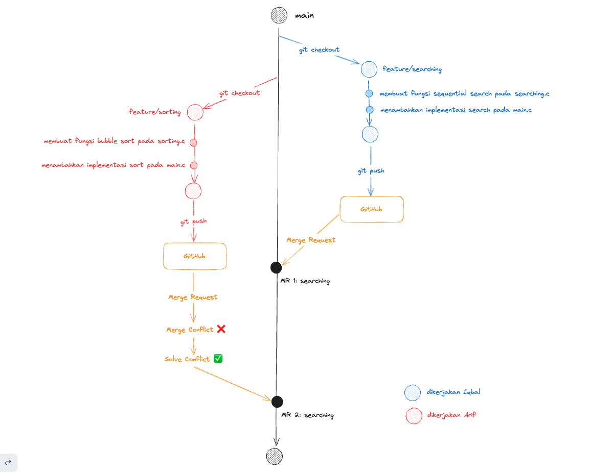

# Menangani Konflik Kode

Konflik pada kode umumnya terjadi ketika lebih dari 1 commit mengubah file dengan baris kode yang sama. Salah satu alasan terjadinya konflik adalah kalian dan teman kalian mengubah file yang sama, semisal `main.c` pada baris 1. MR teman kalian merge terlebih dahulu ke main, ketika kalian membuat MR maka akan ada penanda Merge Conflict disana

Sehingga kalian perlu melakukan step tambahan untuk melakukan penanganan terhadap konflik yang terjadi.
